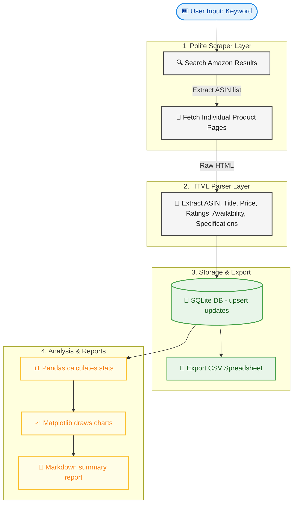
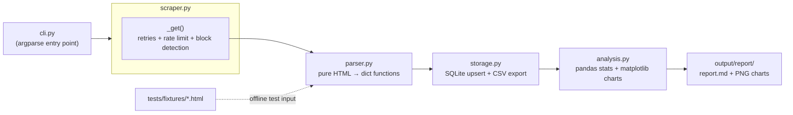

# Amazon Data Scraper

A resilient, testable web scraping pipeline for Amazon search results and
product pages, built with the **`scrapling`** framework. It searches for a
keyword, visits each result's product page for full detail, stores
everything in SQLite (with CSV export), and generates an analysis
report with charts.

🔗 **Live Demo:** [View Live Streamlit App (Placeholder - Replace with your deployment link)](https://your-demo-link.streamlit.app/)

## How It Works: Step-by-Step

This project takes a user's search query, gathers detailed data, saves it safely, and produces visual reports. Here is the visual flow and step-by-step breakdown of how data travels through the system:



### The 5-Step Pipeline Lifecycle

For example, when you run: `python cli.py run --keyword "wireless mouse" --max-results 10`

---

#### 1. 🔍 Step 1: Search & Discovery
* **What happens:** The scraper visits Amazon's search results page for the keyword `"wireless mouse"`.
* **What is extracted:** The parser reads the search results page to identify individual product listings and extracts:
  * **ASIN** (Amazon's unique product identifier, e.g., `B084226C1M`)
  * **Title** (Short product title)
  * **URL** (Link to the product detail page)
  * **Initial Price & Ratings**
* **The output:** A list of the top 10 discovered products.

---

#### 2. 📖 Step 2: Deep Detail Enrichment
* **What happens:** The scraper visits each discovered product's detail page (e.g., `amazon.com/dp/B084226C1M`) one-by-one.
* **Why it does this:** Search result pages omit a lot of detail. By visiting the individual product page, the parser extracts:
  * **Bullet Points** (Product features, technical specs)
  * **Exact Availability** (e.g., "In Stock", "Only 2 left in stock")
  * **High-Res Images**
* **Politeness:** To avoid getting blocked, the scraper randomizes headers and pauses (adds dynamic delays) between requests.

---

#### 3. 💾 Step 3: SQLite Upsert & CSV Export
* **What happens:** The merged search + detail page data is sent to the database.
* **Upsert logic:** If a product with the same ASIN was previously scraped, it updates the record with any new info. If it's new, it creates a new record.
* **CSV Export:** The program immediately updates and saves a user-friendly spreadsheet: `output/products.csv`.
* **The output:** An updated database (`output/amazon_data.db`) and a CSV spreadsheet.

---

#### 4. 📊 Step 4: Pandas Calculations & Charts
* **What happens:** The analysis engine takes over. Pandas reads the database records and calculates summary statistics:
  * Average price, median price, price range (minimum and maximum).
  * Average product rating.
  * Total reviews across all scraped products.
* **Visualization:** Matplotlib creates three visual insights:
  1. `price_distribution.png` (Histogram showing the range and concentration of prices)
  2. `rating_vs_price.png` (Scatter plot showing if higher prices lead to better ratings)
  3. `top_reviewed.png` (Bar chart displaying the top 10 most popular products)

---

#### 5. 📝 Step 5: Final Report Generation
* **What happens:** The stats and charts are packaged together.
* **The output:** A clean markdown report is written to `output/report/report.md`. This report compiles all the numerical stats and embeds the charts for quick viewing.

---

## Why this project is structured the way it is

Amazon is one of the harder sites to scrape reliably: markup changes
often, and aggressive bot detection can return CAPTCHA pages instead of
content. Rather than pretend that away, this project is built around it:

- **Parsing is decoupled from networking** (`parser.py` has zero network
  code). This is the single most important design choice here — it means
  the extraction logic is unit-tested against saved HTML fixtures, so the
  test suite is fast, deterministic, and doesn't depend on Amazon being
  reachable at test time.
- **The scraper detects soft-blocks** (CAPTCHA / bot-check pages) and logs
  them explicitly rather than silently returning garbage data.
- **Retries use exponential backoff with jitter**, and requests are spaced
  out with randomised delays — polite by default, not a hammer.
- **Every layer has a single responsibility** (network → parse → store →
  analyze), which is what makes each layer independently testable and
  replaceable (e.g. swapping SQLite for Postgres only touches `storage.py`).
## Tech Stack & Choice of Libraries

Here is a breakdown of which library is used in which area of the project, and why it was selected over alternatives:

### 1. Web Scraping & DOM Parsing: `scrapling`
* **Where it is used:** Used inside the Streamlit dashboard app (`app.py`), the parser (`parser.py`), and scraper (`scraper.py`).
* **Why this library:** 
  * **Stealth Bypass:** Standard libraries like `requests` or `urllib` send generic Python client headers and handshakes that Amazon's bot detection blocks instantly. `scrapling` uses `curl_cffi` under the hood to perform browser TLS/JA3 fingerprint impersonation, making requests appear indistinguishable from real web browsers.
  * **Unified DOM Selectors:** It provides a Scrapy-like CSS/XPath selector API (`Selector`) that is extremely fast, chainable, and clean compared to BeautifulSoup.
  * **Robust Fallback:** Supports dynamic fetching and header generators out-of-the-box.

### 2. Under-the-Hood Impersonation: `curl_cffi`
* **Where it is used:** Implicitly called by `scrapling.Fetcher` during HTTP requests.
* **Why this library:** Traditional Python request libraries cannot spoof TLS fingerprints. `curl_cffi` compiles curl with mimicked Chrome/Firefox TLS handshakes. Without this, scraping Amazon is virtually impossible without immediately hitting CAPTCHAs.

### 3. Header Generation: `browserforge`
* **Where it is used:** Implicitly called by Scrapling to generate request headers.
* **Why this library:** It automatically generates realistic user agents, screen dimensions, and matching headers to mimic real browser footprints.

### 4. Data Processing: `pandas`
* **Where it is used:** Analytics and reporting calculations.
* **Why this library:** It is the industry standard for fast, high-performance data manipulation in Python. It simplifies loading database queries into dataframes, running calculations (mean, median, ranges), and cleaning null values.

### 5. Plotting & Visualizations: `matplotlib`
* **Where it is used:** Chart rendering (`price_distribution.png`, `rating_vs_price.png`, `top_reviewed.png`).
* **Why this library:** Matplotlib allows headless rendering (`matplotlib.use("Agg")` backend) which creates high-quality PNG charts silently in the background without needing a graphic display window (server-friendly).

### 6. Relational Storage: `sqlite3`
* **Where it is used:** Saving scraped data.
* **Why this library:** SQLite is serverless, file-based, and built into the Python standard library. It requires zero configuration, yet supports robust SQL operations like transaction safety and `ON CONFLICT DO UPDATE` (upserting) to prevent duplicate product records.

### 7. Interactive Web UI: `streamlit`
* **Where it is used:** Serving the dashboard UI (`app.py`).
* **Why this library:** Streamlit allows writing pure-Python web interfaces that run in real-time, completely replacing complex HTML/JS/CSS frontend development with quick, clean reactive widgets (sliders, inputs, dataframes, images, tabs).

## Architecture



## Project layout

```
amazon_scraper/
├── amazon_scraper/
│   ├── config.py       # headers, delays, retry policy, storage paths
│   ├── utils.py         # logging, retry/backoff decorator, rate limiter
│   ├── parser.py        # pure HTML → structured data (the tested core)
│   ├── scraper.py       # HTTP layer: sessions, retries, block detection
│   ├── storage.py       # SQLite upsert + CSV export
│   └── analysis.py      # pandas summary stats + matplotlib charts
├── tests/
│   ├── fixtures/         # saved HTML samples used for offline parser tests
│   ├── test_parser.py
│   ├── test_storage.py
│   └── test_utils.py
├── cli.py                # command-line entry point
├── requirements.txt
├── .env.example
└── output/                # generated at runtime: db, csv, charts, report
```

## Setup

### Prerequisites
This project requires Python 3.10+ and the following core dependencies:
- **`scrapling`**: Advanced web scraping & selection framework.
- **`curl_cffi`**: C-based HTTP client that impersonates real browsers to bypass anti-bot systems.
- **`playwright` & `browserforge`**: Helpers for DOM emulation and realistic browser header generation.
- **`pandas` & `matplotlib`**: Data processing and statistical plotting.
- **`streamlit`**: User-friendly browser dashboard.

### Installation Steps
```bash
python3 -m venv venv
source venv/bin/activate          # Windows: venv\Scripts\activate
pip install -r requirements.txt
cp .env.example .env              # optional: tune delays/retries/proxy
```

## Usage

### Option A: Web App Dashboard (Streamlit)
To run a user-friendly browser interface where you can trigger crawls, view data tables, download CSVs, and examine analytical charts:
```bash
streamlit run app.py
```
Open [http://localhost:8501](http://localhost:8501) in your browser.

### Option B: Terminal (CLI Commands)
Run the full pipeline (search → enrich → store → analyze):

```bash
python cli.py run --keyword "wireless mouse" --max-results 15
```

Re-run analysis on whatever's already in the database (no new scraping):

```bash
python cli.py analyze
```

Export the current database to CSV:

```bash
python cli.py export
```

Output lands in `output/`: `amazon_data.db`, `products.csv`, and
`report/` (containing `report.md` plus `price_distribution.png`,
`rating_vs_price.png`, and `top_reviewed.png`).

## Testing

```bash
pytest tests/ -v
```

All 30 tests run offline against saved HTML fixtures in
`tests/fixtures/` — no network access or live Amazon connection is
required or used in the test suite.

## Known limitations (read before running against live Amazon)

- **Bot detection.** Amazon may serve a CAPTCHA/bot-check page instead of
  real content, especially with sustained or high-frequency requests.
  `scraper.py` detects this pattern and logs it rather than saving junk
  data, but it does not attempt to solve CAPTCHAs or route around blocks.
- **Markup drift.** Amazon's HTML structure changes periodically. If
  fields start coming back empty, the CSS selectors in `parser.py` are
  the first place to check — that's exactly why they're isolated in one
  file.
- **Scale.** Reliable scraping at volume typically requires residential
  proxies and slower, more human-like pacing than most portfolio projects
  need to demonstrate. `SCRAPER_PROXY` is wired up for this but no proxy
  provider is bundled or endorsed.
- **Terms of Service.** Amazon's terms restrict automated data collection.
  This project is intended for personal learning/demonstration on a small
  number of requests with polite rate-limiting, not production or
  commercial use. Check current ToS and `robots.txt` before scraping any
  site, and consider official APIs (e.g. Amazon's Product Advertising
  API) for real applications.

